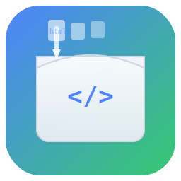

<div align="center">

# 📦 WebPackager

**Turn your HTML/CSS/JS into a real Windows desktop app — in one click.**

[](https://github.com/lilyco-42/web-packager/actions/workflows/build.yml)
[](LICENSE)
[](https://github.com/lilyco-42/web-packager/releases)
[](https://developer.microsoft.com/microsoft-edge/webview2/)



</div>

---

## ✨ What It Does

WebPackager is a desktop GUI tool that **packages web files into standalone `.exe` files**.

You write HTML/CSS/JS → WebPackager wraps it into a native Windows app → Share the EXE with anyone.

✅ **Full JavaScript support** — not a screenshot, it's a real WebView2 browser engine  
✅ **No runtime required** — generated EXEs only need WebView2 (Windows 10+ has it built-in)  
✅ **Live preview** — see your page as you build  
✅ **Bilingual** — English / 中文  

---

## 🚀 Quick Start (30 seconds)

### Option 1: Download & Run

1. Download **[WebPackager_SFX.exe](https://github.com/lilyco-42/web-packager/releases/latest)** (single file, self-extracting)
2. Double-click — it extracts and runs automatically
3. Drop your HTML files in → Click **Build EXE** → Done 🎉

### Option 2: Portable ZIP

Download `dist.zip` from [Releases](https://github.com/lilyco-42/web-packager/releases), unzip, run `web_packager.exe`.

---

## 📖 Usage Guide

### 1️⃣ Add Your Web Files

| Step | Screenshot |
|:-----|:-----------|
| Click **Add Files** or press `Ctrl+O` | ![add-files] |
| Select `.html`, `.css`, `.js` files (multi-select!) | |
| Files appear in the left panel with type icons: `[H]` HTML, `[C]` CSS, `[J]` JS | |

### 2️⃣ Preview

The center panel shows a live WebView2 preview that updates automatically as you add or edit files.

### 3️⃣ Configure

| Setting | What it does |
|:--------|:-------------|
| **App Name** | Name of your generated `.exe` |
| **Width / Height** | Window size of the generated app |
| **Output Dir** | Where to save the generated EXE |

### 4️⃣ Build

Click **Build EXE** or press `F7`. A progress window shows:

```
┌─────────────────────────────────┐
│  Build EXE                      │
│  ───────────────────────────    │
│  Elapsed: 0:12                  │
│  ████████████████████░░░  85%   │
│  ─── details ────────────       │
│  > g++ -c main.cc ...           │
│  > g++ -o MyApp.exe ...         │
│  Success: EXE generated at ...  │
│  ───────────────────────────    │
│                         [Close] │
└─────────────────────────────────┘
```

### 5️⃣ Share!

Your standalone `.exe` is ready in the output directory. It runs the full browser engine with your JS intact.

---

## 🔧 Example: Todo List App

The generated `透明高级待办清单.html` becomes `MyApp.exe` with:

- ✅ Add / edit / delete tasks
- ✅ Priority tags (high/medium/low)
- ✅ Recurring reminders (daily/weekly/etc.)
- ✅ Data export / import (JSON)
- ✅ Dark mode preview
- ✅ `localStorage` persistence

All JS is fully interactive — not a static screenshot.

---

## 🏗️ Build from Source

<details>
<summary>Click to expand</summary>

### Prerequisites

- **Windows 10/11** (x86_64)
- **CMake** ≥ 3.16
- **MinGW-w64 GCC** ≥ 13 (recommended: via [MSYS2](https://www.msys2.org/) or [Scoop](https://scoop.sh/): `scoop install gcc cmake ninja`)
- **Ninja** build system

### Build

```bash
git clone https://github.com/lilyco-42/web-packager.git
cd web-packager
cmake -B build -G Ninja -DCMAKE_BUILD_TYPE=Release -DCMAKE_CXX_COMPILER=g++
ninja -C build
```

The binary is at `build/bin/web_packager.exe`.

Dependencies (imgui, webview) are fetched automatically via CMake FetchContent.

</details>

---

## 📦 Distribution Packages

| Package | Size | Description |
|:--------|:----:|:------------|
| `WebPackager_SFX.exe` | ~8 MB | **Single-file self-extracting** — download, run, go |
| `dist.zip` | ~7 MB | Portable folder, unzip and run `web_packager.exe` |

Both include the `lib/` directory with pre-built webview libraries needed for the build pipeline.

---

## 🧩 How It Works

```
┌─────────────────────────────────────────────────────┐
│  WebPackager (ImGui + D3D11)                        │
│  ┌──────────┐  ┌──────────────┐  ┌──────────────┐  │
│  │  Files   │  │   Preview    │  │   Build      │  │
│  │  Panel   │  │  (WebView2)  │  │   Settings   │  │
│  └────┬─────┘  └──────┬───────┘  └──────┬───────┘  │
│       │               │                 │           │
│       ▼               ▼                 ▼           │
│  ┌──────────────────────────────────────────┐       │
│  │  Build Pipeline                           │       │
│  │  HTML → embed as C++ raw string           │       │
│  │  → g++ compile + link with webview lib    │       │
│  │  → output: standalone EXE                 │       │
│  └──────────────────────────────────────────┘       │
└─────────────────────────────────────────────────────┘
```

---

## 🤝 Contributing

PRs welcome! Areas that need love:

- **Linux/macOS support** — ImGui backend needs to be adapted
- **More output formats** — Android APK? macOS .app?
- **Themes** — Dark/light mode toggle
- **File watching** — Auto-reload on file save

---

## 📄 License

MIT — use it, modify it, share it. See [LICENSE](LICENSE).

---

<div align="center">
Made with ❤️ for the web-to-desktop community
</div>
